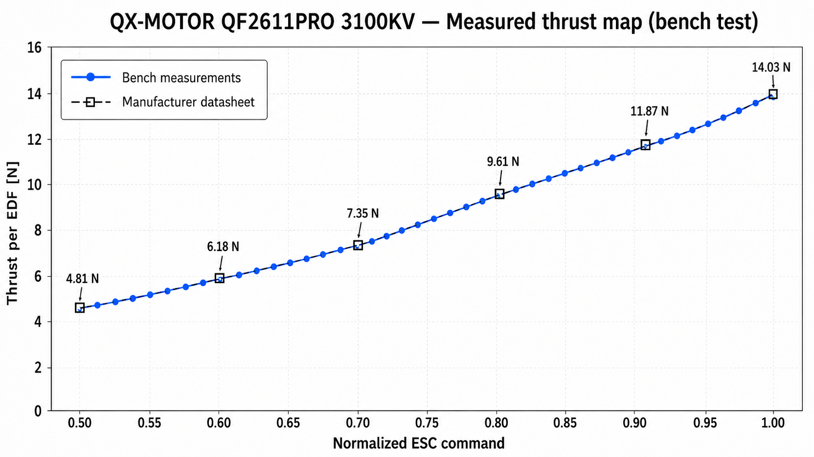
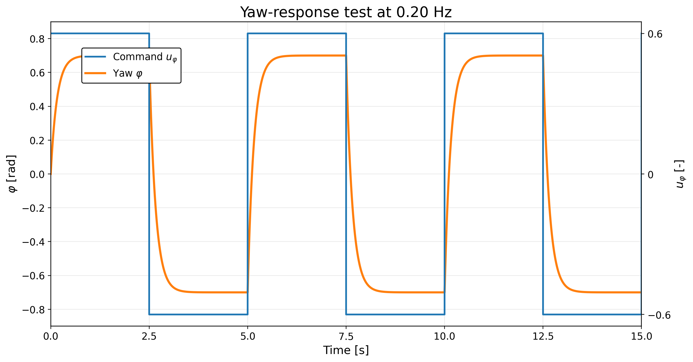
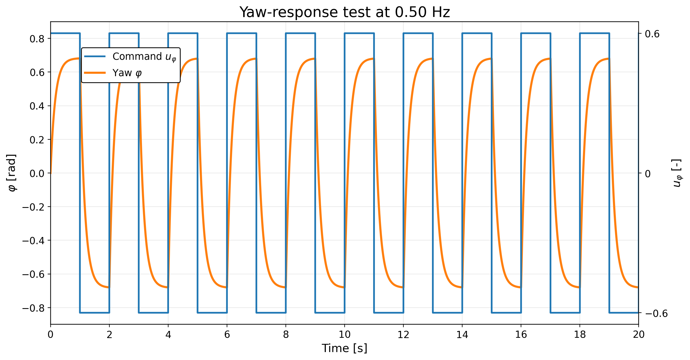
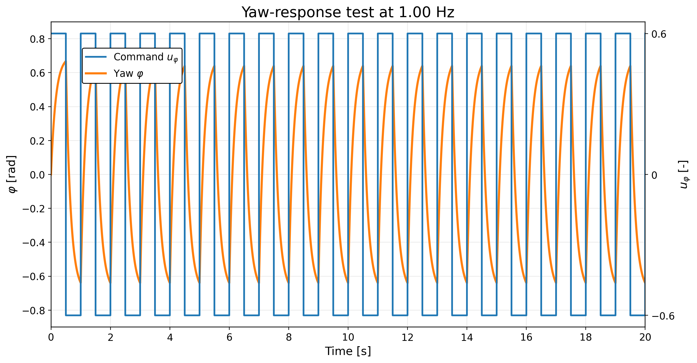
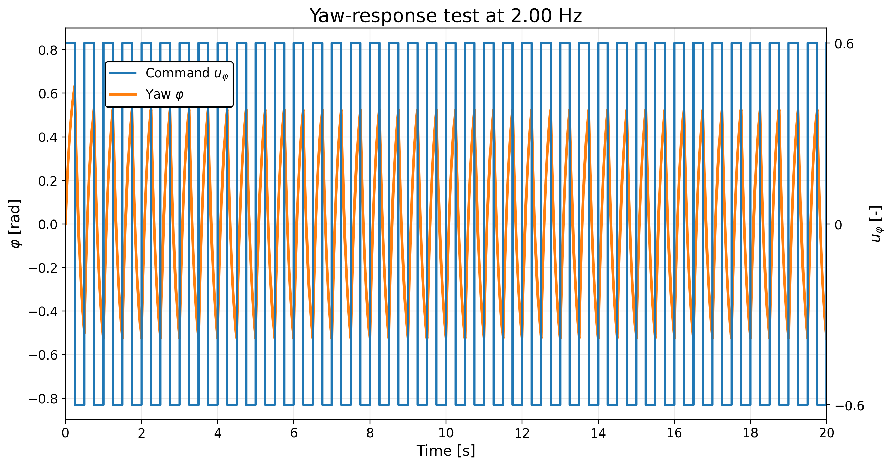

# EDF and attitude tests

## Static thrust-command check

The external interface accepts requested EDF thrust in newtons. The firmware converts this request through the thrust-command map and then generates the ESC PWM signal.

Six static operating points of the selected QX-Motor QF2611PRO EDF were bench checked at 24 V. The measured points were consistent with the manufacturer relationship used to construct the piecewise-linear map.

Important interpretation:
- the command map is feed-forward;
- there is no closed-loop EDF thrust sensor;
- actual thrust can vary with battery voltage, actuator differences and airflow;
- positive requests below the first characterised point are raised to the minimum active command;
- requests above the upper endpoint are saturated.

The available command range reaches **14.03 N per EDF**.

## EDF installation and safety checks

Before closing the attitude loops, all six EDFs were commanded individually to verify:
- T1-T6 assignment;
- thrust direction;
- CW/CCW convention;
- ESC arming;
- return to idle / stop behaviour;
- command limiting.

## Pitch test

The current IMU pitch was captured as the reference and manual disturbances were applied in both directions.

Observed behaviour:
- opposite pitch errors correctly selected T5 and T6;
- the 2°/5° hysteresis operated as configured;
- the 9.61 N command-equivalent active floor was applied;
- slew limiting operated as configured;
- the 65° safety cut-off operated as configured.

## Yaw test

Manual yaw disturbances were introduced around a captured IMU yaw reference.

Observed behaviour:
- positive and negative errors selected the expected yaw pairs;
- positive yaw command -> T1 + T3;
- negative yaw command -> T2 + T4;
- 3°/11° hysteresis operated as configured;
- yaw-rate damping and command slew limiting operated as configured.

The active target was approximately 5.50-7.35 N per selected EDF.

## Yaw pair-switching test

A separate external-command test alternated the two yaw pairs with command magnitude 0.60.

Tested switching frequencies:
- 0.20 Hz - period 5.00 s;
- 0.50 Hz - period 2.00 s;
- 1.00 Hz - period 1.00 s;
- 2.00 Hz - period 0.50 s.

Expected pair selection was observed at all four frequencies.

These experiments verify functional pair switching and body response; they are not a complete quantitative identification of the assembled attitude dynamics.
## Video

The physical attitude-control tests are included in the [ALPINE accompanying video](https://youtu.be/uGnkgwyiz4E?si=PzA2LDuUBlqPTcRI).
