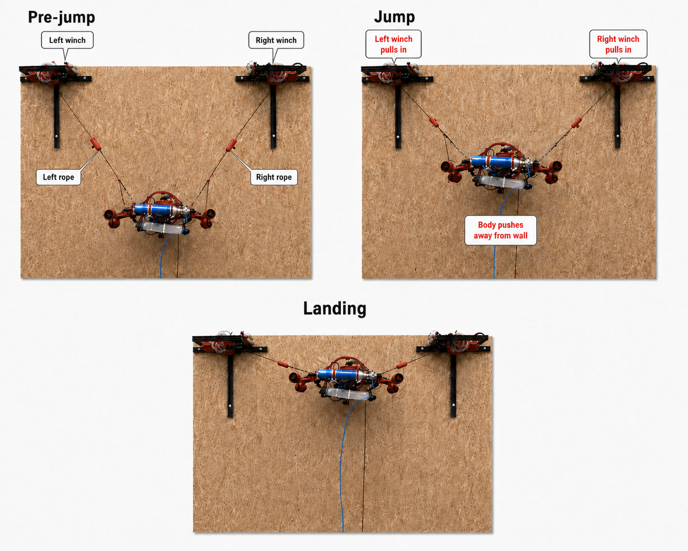

# Integrated jump test

The final physical experiment combined:
- onboard pitch/yaw regulation;
- repeatable winch homing;
- homing-relative rope positioning;
- pneumatic actuation;
- jump rope-force execution;
- body telemetry;
- body-pose reconstruction.

## Sequence

During bring-up, homing and pre-jump positioning:
- the ESP32-S3 continued to run the 100 Hz IMU-feedback attitude loop;
- the two winch nodes performed their local tasks.

During the operator-triggered jump:
- the pneumatic command and left/right winch profiles were coordinated;
- attitude regulation remained active.

After the manoeuvre:
- the current rope coordinates were retained;
- the winches held the reached suspended configuration.

## Observed integration behaviour

More energetic motions and asymmetry between the two winch forces generated visible attitude disturbances and increased corrective demand on the EDF subsystem.

The integrated sequence qualitatively showed the attitude controller driving the body back towards a configuration in which the landing-leg axis was approximately aligned with the wall normal.

## Demonstrated result

The experiment demonstrates that the following subsystems can operate together during the physical jump sequence:

- attitude regulation;
- winch control;
- pneumatic actuation;
- telemetry;
- body-pose reconstruction.

The experiment does **not** demonstrate:
- quantitative trajectory tracking against an external ground truth;
- automatic touchdown detection;
- autonomous consecutive physical jumps;
- fully planner-driven multi-jump operation.
## Video

The physical jump and integrated pipeline are included in the [ALPINE accompanying video](https://youtu.be/uGnkgwyiz4E?si=PzA2LDuUBlqPTcRI).
