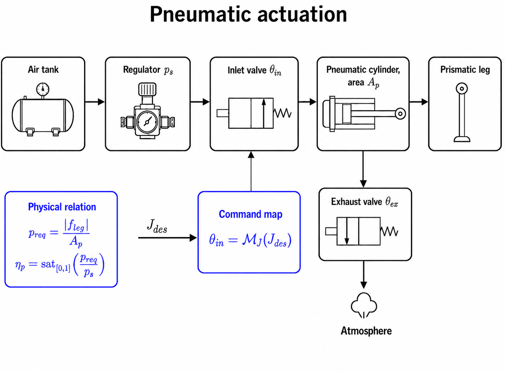
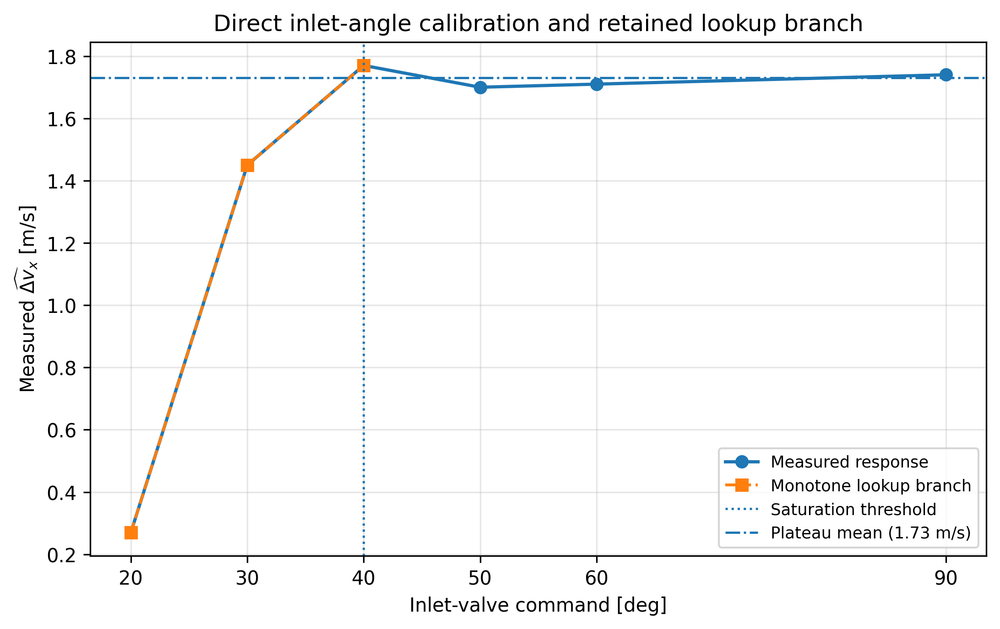
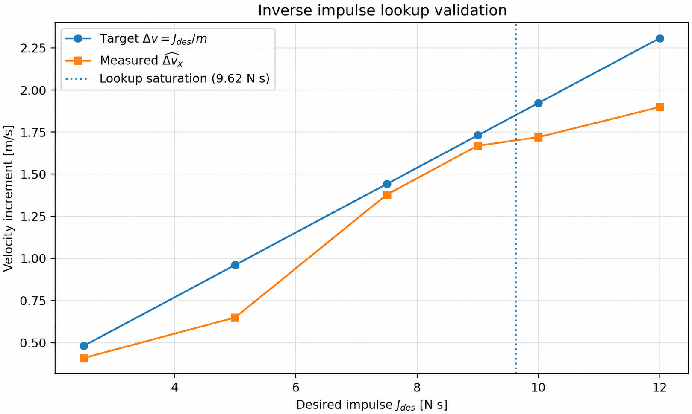

# Pneumatic actuator tests

The pneumatic subsystem was characterised independently on the earlier suspended **5.2 kg** body at approximately **3.6 bar**.

## Direct inlet-angle characterisation

Measured body-axis velocity increment at lift-off:

| inlet angle | measured velocity increment | regime |
|---:|---:|---|
| 20° | 0.27 m/s | near-threshold |
| 30° | 1.45 m/s | rising response |
| 40° | 1.77 m/s | plateau onset |
| 50° | 1.70 m/s | plateau |
| 60° | 1.71 m/s | plateau |
| 90° | 1.74 m/s | saturated-command plateau |

The response is strongly nonlinear between approximately 20° and 40° and then reaches a plateau.

The runtime lookup retains the increasing branch and uses **(90°, 1.85 m/s)** as its configured full-open endpoint. The 1.85 m/s value is a lookup saturation value, not an additional measured increase beyond the plateau.

## Inverse impulse map

For the 5.2 kg calibration configuration:

\[
J_{des}=m_{cal}\Delta v_{des}
\]

with \(m_{cal}=5.2\) kg.

The configured full-open endpoint corresponds to approximately **9.62 N s**.

Requests above the runtime threshold are mapped to the full-open 90° command.

## Limitation

This map is empirical for the tested 5.2 kg suspended configuration. The integrated approximately 10 kg body and intended 4.5 bar supply pressure require a **new calibration before the map is used quantitatively**.
