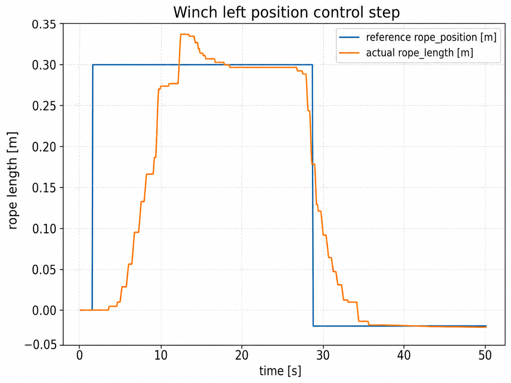
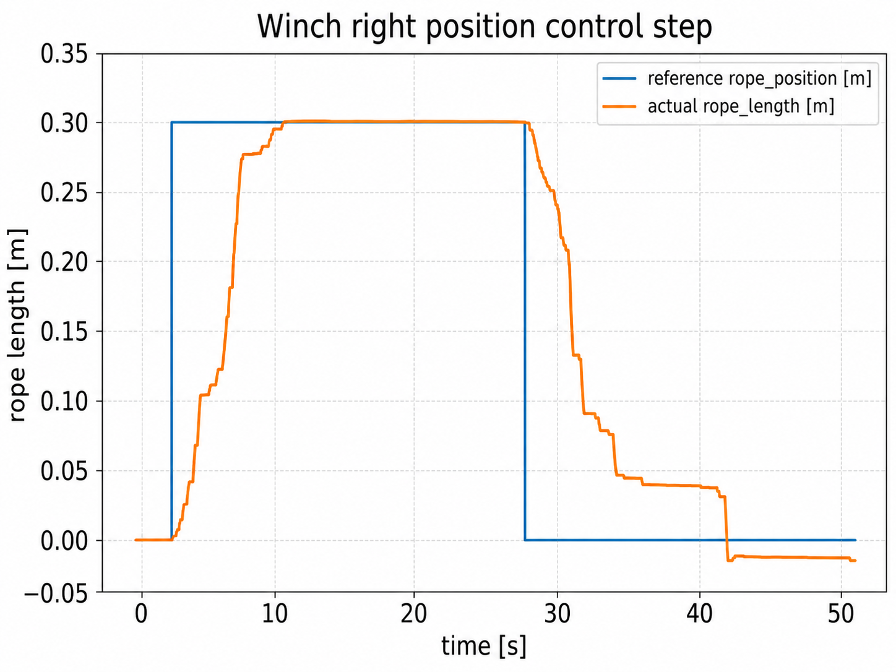

# Winch and odometry tests

## Rope-position step tests

After homing, the two winches were tested separately with a +0.30 m homing-relative position step.

Both coordinates moved in the commanded direction and approached the requested reference.

Observed differences:
- the left response showed a small overshoot;
- the right response was slower and retained a small residual offset during the return towards zero.

Because the two recordings were acquired in separate runs, these transients should not be interpreted as a direct quantitative left/right comparison.

## Odometry / RViz

The body-pose reconstruction was run during physical tests as a diagnostic.

Observed behaviour:
- body orientation in RViz followed the IMU;
- reconstructed body position followed rope-coordinate changes;
- the live two-rope overlay remained consistent with the observed geometry.

This is a **qualitative consistency check**. Absolute accuracy was not measured because no independent external pose reference was available.

See [[Body_Pose_Reconstruction]].
## Video

The RViz / odometry behaviour is included in the [ALPINE accompanying video](https://youtu.be/uGnkgwyiz4E?si=PzA2LDuUBlqPTcRI).
