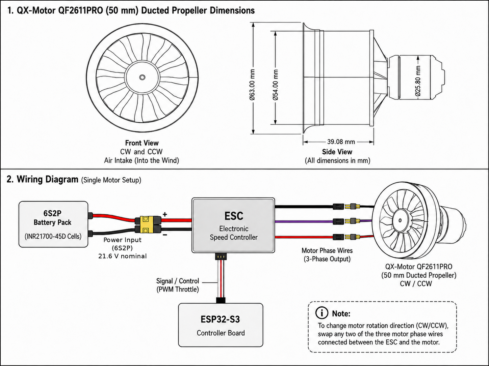
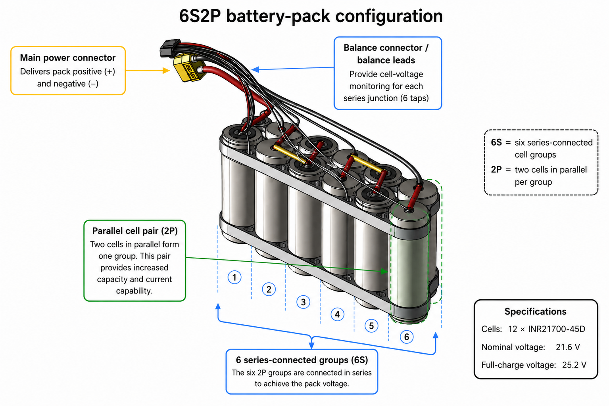
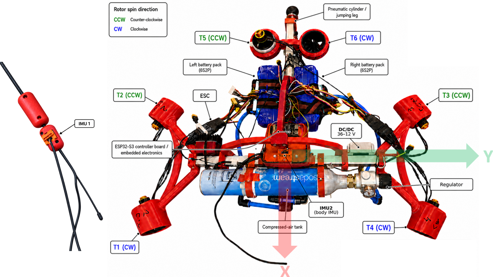

# Body propulsion electronics

The six-EDF propulsion system is powered and controlled independently from the low-power command signals.

## Single EDF chain

For each propeller:
1. the **ESP32-S3** generates a servo-style PWM reference;
2. the **ESC** interprets the pulse width and commutates the motor;
3. propulsion power is supplied through the high-current battery path.

The PWM signal is therefore only a low-power command signal.

### ESC command

- PWM frame rate: **50 Hz**
- stop / minimum pulse: **1000 µs**
- normalised internal command: \(d \in [0,1]\)
- pulse relation:

\[
t_{\mathrm{PWM}} = 1000 + 1000d \quad [\mu s].
\]

The attitude controller itself updates at **100 Hz**. These are different rates: the controller can update its desired command every 10 ms while the ESC PWM peripheral transmits the most recent pulse using a 20 ms frame.

## Battery architecture

The propulsion supply uses **two 6S2P lithium-ion packs** based on INR21700-45D cells.

Each pack supplies three EDF-ESC branches in parallel.

Nominal pack voltage:
- approximately **21.6 V** from six series-connected cell groups.

Design operating point for three EDFs on the same pack:
- 9.61 N per EDF;
- 21 A per EDF;
- 504 W per EDF;
- ideal pack current: 63 A;
- ideal pack power: 1512 W;
- ideal cell current in one 2P group: 31.5 A.

The two packs are mounted on opposite sides of the body to distribute mass and reduce high-current wiring length.

## Body controller and sensors

The **ESP32-S3**:
- reads two Movella IMUs;
- runs the onboard pitch/yaw regulation;
- commands all six ESCs;
- drives the pneumatic servos;
- parses host commands;
- publishes body telemetry.

Sensor roles:
- **IMU2**: rigidly mounted on the body; provides the quaternion used for attitude feedback.
- **IMU1**: mounted on the left rope-side measurement assembly; provides the rope-direction measurement used by the post-homing body-pose reconstruction.

## Safety behaviour

At start-up the ESCs are held at minimum pulse during the arming sequence. Requested thrust is limited before conversion to the ESC command. Explicit stop and safety conditions return the affected channels to the 1000 µs stop pulse.

See [[Attitude_Control]] for the feedback logic and [[EDF and attitude tests]] for the physical checks.
