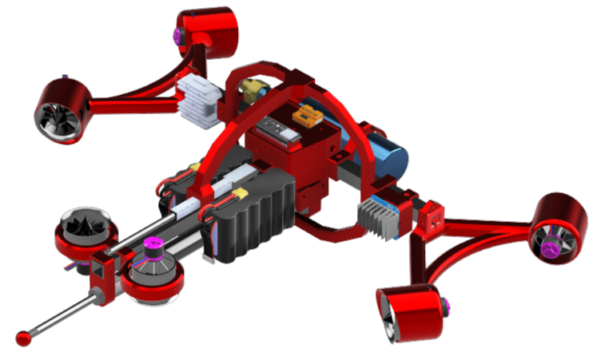
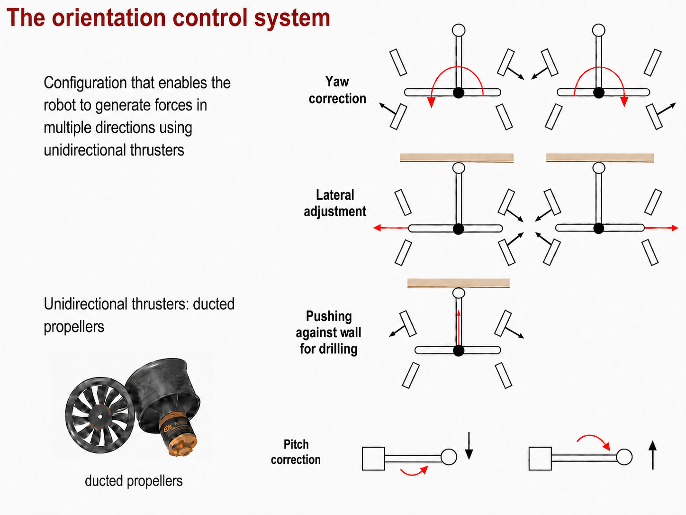
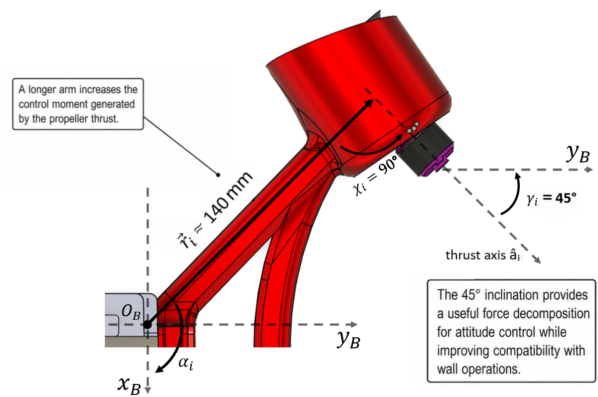

# EDF attitude-control system

The current ALPINE body uses **six QX-Motor QF2611PRO 50 mm EDFs** to regulate pitch and body yaw while the two ropes remain responsible for support and in-plane motion.

## Control objective

The primary objective is to orient the pneumatic landing leg approximately along the local wall normal before landing.

The installed EDF system is used for:
- pitch correction;
- yaw correction;
- lateral body adjustment available from the four side EDFs;
- auxiliary wall-normal force during wall-interaction tasks.

Roll is measured but is not actively regulated by the EDFs because the two separated taut suspension lines provide a passive restoring effect in that direction.

## Propeller numbering and roles

| EDF | Main role | Installed spin |
|---|---|---|
| T1 | lower-left lateral / positive yaw pair | CW |
| T2 | upper-left lateral / negative yaw pair | CCW |
| T3 | upper-right lateral / positive yaw pair | CCW |
| T4 | lower-right lateral / negative yaw pair | CW |
| T5 | negative pitch correction | CCW |
| T6 | positive pitch correction | CW |

### Deterministic lateral allocation

The four lateral EDFs are selected in complementary pairs:

| Requested action | Active EDFs |
|---|---|
| positive yaw moment | T1 + T3 |
| negative yaw moment | T2 + T4 |
| positive body-frame Y force | T1 + T2 |
| negative body-frame Y force | T3 + T4 |
| positive body-frame X force | T1 + T4 |
| negative body-frame X force | T2 + T3 |

The two yaw pairs each combine one CW and one CCW rotor, reducing the reaction-torque contribution while the useful geometric yaw moments add.

Pitch is handled separately: the sign of the pitch command selects either T5 or T6.

## Mount geometry

The lateral mounts have an approximately **140 mm** distance from the body-frame origin to the thrust application point. Their thrust axes are mounted approximately tangentially and at about **45°** with respect to the body-frame Y direction.

For one EDF,

\[
\mathbf{f}_i = F_i \hat{\mathbf{a}}_i,\qquad
\boldsymbol{\tau}_i = \mathbf{r}_i \times \mathbf{f}_i.
\]

The complete actuator wrench is

\[
\mathbf{w} = A_F \mathbf{F}.
\]

The physical EDFs are unilateral and bounded:

\[
0 \le F_i \le F_{\max}.
\]

For the selected QF2611PRO EDF, the adopted upper bound is **14.03 N per EDF**.

## EDF selection

The final actuator choice was made by comparing the available static thrust, actuator weight and simulated yaw response of three candidates:

- XFly 50 mm, 4S;
- QX-Motor QF2611PRO 50 mm, 6S;
- Freewing 64 mm, 6S.

The QX-Motor QF2611PRO was selected as the best compromise for the installed geometry.

Manufacturer reference points used in the design:
- 9.61 N at 24 V, 21 A, 504 W;
- 14.03 N at 24 V, 38 A, 912 W.

The implemented thrust-command map is documented in [[EDF and attitude tests]].

## Related pages

- [[Body propulsion electronics]]
- [[Attitude_Control]]
- [[Experimental validation]]
