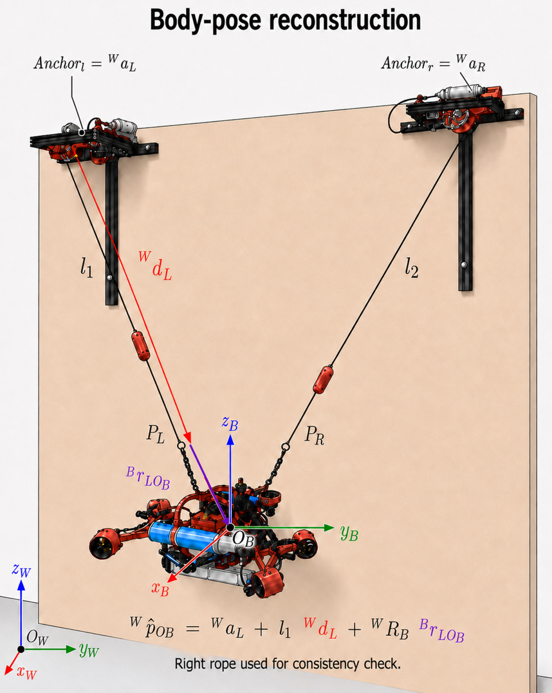

# Body-pose reconstruction

The physical ALPINE platform reconstructs body pose from:
- homing-relative rope coordinates;
- known anchor positions;
- a measured left-rope direction;
- the body IMU orientation;
- fixed robot attachment geometry.

## Geometry

Let:
- \(^{W}\mathbf{a}_L\), \(^{W}\mathbf{a}_R\): known world-frame anchor positions;
- \(l_1,l_2\): rope coordinates obtained after homing;
- \(^{W}\mathbf{d}_L\): measured unit direction from the left anchor towards the left body rope attachment;
- \(P_L,P_R\): physical body rope attachment points;
- \(O_B\): body-frame origin;
- \(^{B}\mathbf{r}_{L O_B}\): fixed vector from \(P_L\) to \(O_B\), expressed in the body frame;
- \(^{W}R_B\): body attitude from the body IMU.

The reconstructed body origin follows the left anchor/rope chain and the rotated body offset:

\[
^{W}\mathbf{p}_{O_B}
=
^{W}\mathbf{a}_L
+
l_1\,^{W}\mathbf{d}_L
+
^{W}R_B\,^{B}\mathbf{r}_{L O_B}.
\]

The right rope is used as a geometric consistency check.

## Interpretation

This is a **post-homing odometry reconstruction**, not an independently measured absolute pose.

The method assumes:
- taut ropes;
- known anchor geometry;
- correct rope offsets after homing;
- correct IMU orientation;
- fixed attachment geometry.

## RViz validation

During physical tests:
- the displayed body orientation followed the body IMU;
- the reconstructed body pose followed rope-coordinate changes;
- the two-rope overlay remained qualitatively consistent with the observed geometry.

No motion-capture or other external absolute pose reference was available, so absolute pose accuracy was **not** quantified.

This visualisation path should therefore be used as a diagnostic until an external reference is added.
