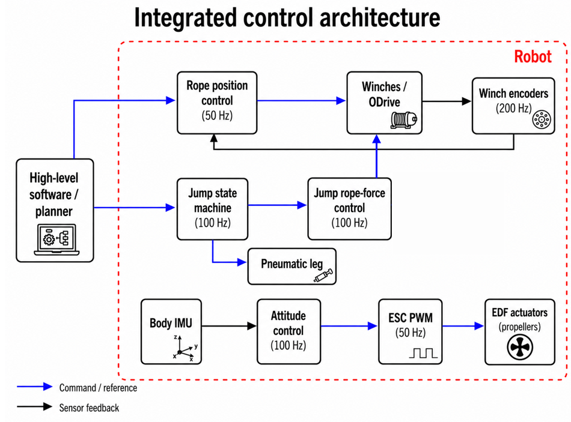

# Flow of program - integrated physical platform

The current real-robot software is organised around **local feedback loops** and a **high-level coordinator**.



## Main control paths

### Body attitude

`Body IMU -> attitude controller -> EDF command -> ESC -> propellers`

- body IMU feedback;
- pitch/yaw controller at 100 Hz;
- ESC command interface;
- six fixed-axis EDFs.

The attitude loop stays active during homing, pre-jump positioning and the jump sequence.

### Winch position

`rope reference -> local rope-position controller -> winch / ODrive -> encoder -> rope coordinate`

- rope-position control: 50 Hz;
- encoder update: 200 Hz;
- coordinates are homing-relative.

### Jump execution

`planner / high-level software -> jump state machine -> pneumatic leg + winch force commands`

The planner provides:
- desired pneumatic-leg force;
- thrust duration;
- left and right rope-force profiles.

The jump state machine converts these references to the actuator interfaces and prevents competing commands.

## Command ownership

A central integration rule is that each actuator is controlled by **one command source at a time**.

Typical ownership:

| Phase | Winches | Pneumatic leg | EDFs |
|---|---|---|---|
| Bring-up | local safe state | closed | attitude subsystem armed |
| Homing | homing controller | closed | attitude feedback active |
| Pre-jump positioning | rope-position controller | closed | attitude feedback active |
| Jump | jump rope-force command | jump command | attitude feedback active |
| Landing / post-jump hold | position/hold at reached coordinates | closed/vented | attitude feedback active |

The tested sequence does **not** automatically return to the take-off configuration. After landing, the robot holds the newly reached suspended configuration.

## Experimental sequence

```text
Bring-up
   |
   v
Homing
   |
   v
Pre-jump positioning
   |
   v
User-triggered jump
   |
   v
Landing / post-jump hold
```

Another jump can then be triggered by the user from the new suspended state.

## Important current limitations

- lift-off and touchdown are not detected by dedicated contact sensors;
- the jump transition is time based;
- automatic planner-driven consecutive physical jumps were not validated;
- direct rope tension is not measured;
- absolute body-pose accuracy was not validated with an external reference.

See [[Jump_Execution_Pipeline]] and [[Experimental validation]].
