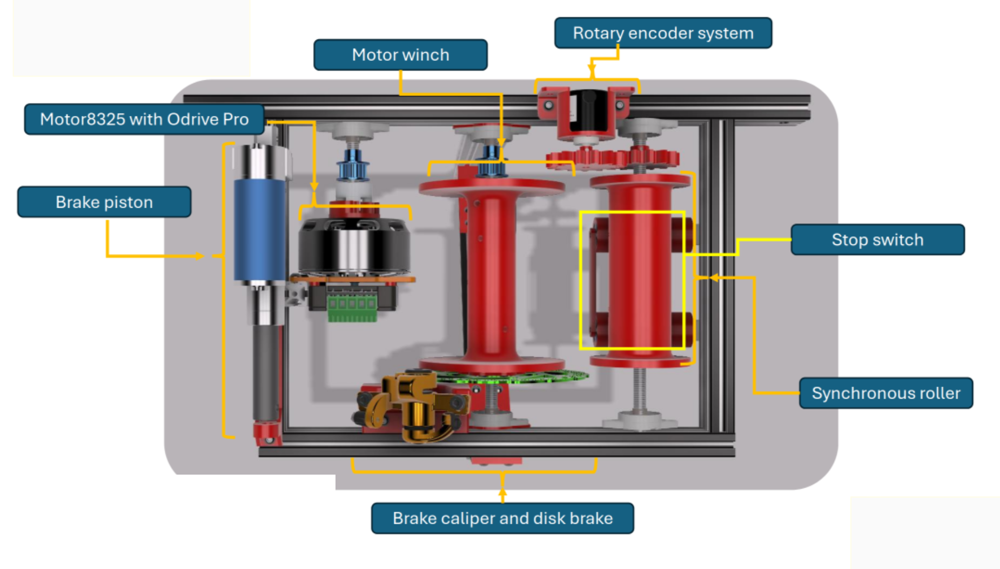
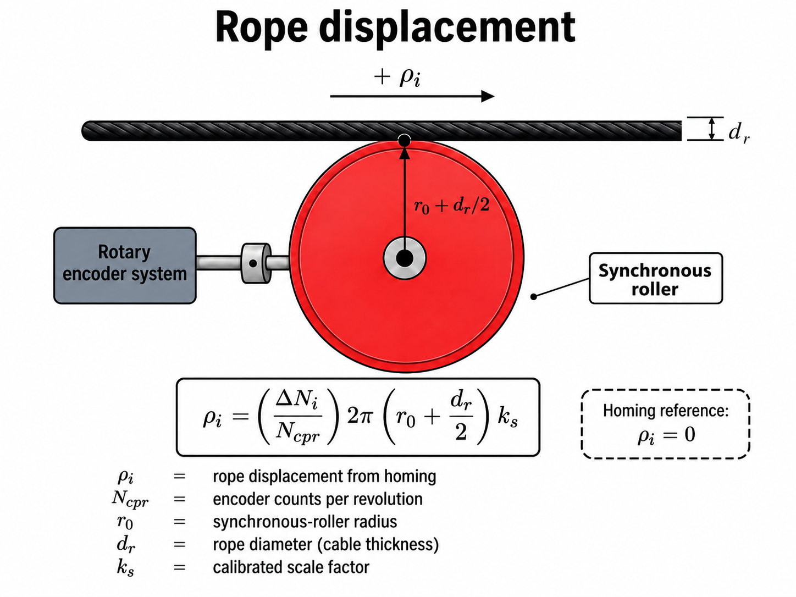
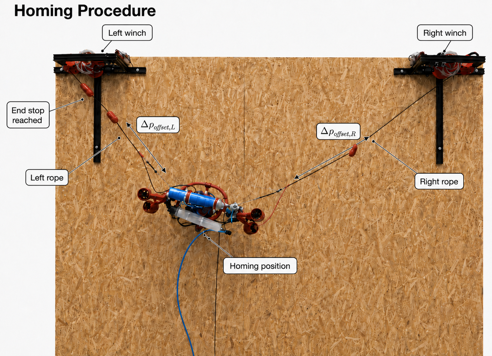

# Winch homing and position control

Each ALPINE winch combines a motorised winding drum with a separate synchronous rope-measurement roller.

## Why the synchronous roller is used

The effective radius of the winding drum changes as rope layers accumulate. Using drum rotation directly would therefore produce a rope-length estimate that depends on the current layer.

The synchronous measurement roller does not wind the rope and maintains an approximately constant radius, so its incremental encoder is used for rope displacement.

## Homing-relative rope coordinate

The encoders are relative and do not provide absolute rope length after power-up.

Homing associates encoder zero with a repeatable mechanical configuration.

For each winch \(i\), the calibrated rope displacement is based on:
- encoder counts per revolution: **2400**;
- measurement roller radius: **0.025 m**;
- rope diameter: **0.005 m**;
- calibrated scale factor: **2.31**.

The encoder displacement is then mapped into the reduced-model rope coordinates using configured homing offsets and side-dependent signs.

> Encoder zero after homing does not mean zero physical rope length.

In the reported indoor setup, the left physical homing offset was approximately **0.30 m**; the right offset was larger and was set from the corresponding homing geometry.

## Homing procedure

Both winches pull the suspended robot upward until the mechanical reference is reached. The homing-relative encoder coordinates are then reset.

## Rope-position controller

The local controller compares the requested and measured homing-relative rope coordinates.

The implemented controller is a deadbanded proportional velocity controller with a configured speed limit.

- position loop: **50 Hz**
- encoder feedback: **200 Hz**

The tests showed that both left and right coordinates moved in the requested direction and approached a +0.30 m step reference.

## Rope-force estimate

Direct rope tension was **not measured** in the reported experiments.

A model-based estimate can be obtained from ODrive motor torque through the effective winch transmission and winding radius. Friction and transmission losses are not explicitly removed, so this quantity must be treated as an estimate rather than a load-cell measurement.

Direct load cells and winch transmission identification are planned future improvements.

See [[Winch and odometry tests]].
